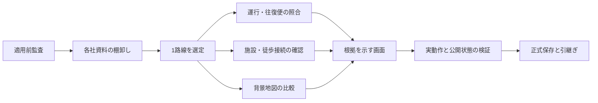

# バスと徒歩による生活圏の検証

## 到達点と権限

2026-09-14、ユーザーは施設情報・各社バス路線・背景地図を率直に見直す提案に対し、「じっくりその内容で進めてほしい」と指示した。最初の検証単位は、資料が揃う1路線・5〜10停留所で、平日午前に買い物へ行き昼までに帰れる候補を根拠付きで示すこと。件数増加を成果の代用にしない。

完了条件は、選定根拠・対象日の運行と往復便・乗り場の対応・主要施設の利用条件・徒歩接続の根拠と未確認点・同地域の背景地図比較を、第三者が原資料から追えること。画面へ反映する場合は、計算上の候補、資料照合、現地確認を区別する。現地未確認を実際に歩ける証明とは扱わない。

各社の公式資料の棚卸しを先に行い、選んだ路線を深く検証する。最初の1路線の成果を県内全路線の現況確認と呼ばない。資料や確認手段が足りない項目は未確認として記録し、依存しない作業を継続する。

非積算案件。正式保存は指定Google Driveの `Codex_非積算プロジェクト / bus-stop-compact-town`。親・接続アカウントの指定を維持し、保存後に必要ファイルを読み戻す。既存原本・施設ID・位置は推測で変更しない。秘密情報は保存しない。外部への連絡・Slack投稿・費用発生・既存ファイルの削除は実施しない。現地の協力や別の権限が必要な工程は、具体的な依頼対象と不足の根拠が揃ってから扱う。

## 実行計画

| ID・状態 | 入力／作業／成果物 | 完了条件・検証 | 実行者・依存 |
|---|---|---|---|
| A0 完了 | project-continuityの適用前監査／説明・コード・隔離試験／検証報告 | 10試験、追加の限界検証、Drive読み戻し | AI／なし |
| A1 完了 | 既存交通原本と各社の公式案内／資料の時点・公開範囲・取得可否を棚卸し／事業者別一覧 | 出典URLと確認日、未調査・不足を区別 | AI／A0 |
| A2 完了 | A1／資料が揃う1路線・5〜10停留所と主要施設を選定／選定記録 | 運行有効期間・地域の生活用途・比較可能性で理由を説明 | AI／A1 |
| A3 完了 | A2と公式時刻表・GTFS等／方向・運行日・往復の時刻と待ち時間を照合／再現可能な往復例 | 対象日・乗降順・公式便との整合を検査。推測した時刻なし | AI／A2 |
| A4 資料調査完了・現地未確認 | A2と施設公式案内・入口資料・道路／利用条件と徒歩接続を調査／施設・歩行の検証台帳 | 資料の範囲と未確認区間を明記し、入口や横断を推測で確定しない | AI、必要箇所は現地確認の協力／A2 |
| A5 完了 | A2の共通地域／現案内図と地理院の背景等を同条件で比較／操作可能な比較または検証資料 | 同じ対象・縮尺で乗り場と施設の判断に必要な情報を評価 | AI／A2 |
| A6 完了 | A3〜A5／根拠・時点・確認範囲を表示し、必要な情報構造と画面を改善／実装・説明 | 福祉等の施設用途を区別し、不足を施設不在と誤表示しない | AI／A3,A4,A5 |
| A7 完了 | A6／データ再現・画面操作・既存機能を検証、公開する成果物は実配信と照合／検証記録 | 想定する買い物の往復を辿れ、未確認を明示。公開状態とローカル検証を区別 | AI、必要なら具体的な最終承認／A6 |
| A8 正式保存・最終読み戻し | A7／原本・継続用ソース・成果物・残課題を正式保存／現在地と引継ぎ | Driveの対象・サイズ・必要ファイルを読み戻し確認 | AI／A7 |

## 適用前監査の判断

ユーザーからproject-continuityの無検証適用への懸念が示されたため、補助CLIと新しいJSON管理方式を導入しない。goal-to-doneと既存Markdown記録を使う。スキルやグローバル設定は変更していない。

- [検証報告](https://drive.google.com/file/d/1y4kMDNQkve6ZkkNUeCIb5CpDnYb2o13o/view) — 5,874 bytes
- [検証結果・再現手順](https://drive.google.com/file/d/14RP9tZSw-UBNNd5ccNG1yDbKNdoG8-3B/view) — 8,367 bytes
- 詳細は [project-continuity-audit-20260914.md](project-continuity-audit-20260914.md)。いずれも指定案件フォルダへの保存と読み戻しを確認済み。

## 現在地

前版の公開・Drive保存・pushは完了済み。公開コミット `ac089cd`、保存記録を含むソースの開始点は `726cc8b`。新しい路線検証は未完了であり、前版の完了記録とは区別する。[公開ページ](https://yyy-yuichi.github.io/bus-stop-compact-town/route-living.html)へ反映済み。[PR #11](https://github.com/yyy-yuichi/bus-stop-compact-town/pull/11)をマージし、公開コミットは `fd08790152ad58a4683e280e3aa7103f349e3c6f`。[Pages 34793427205](https://github.com/yyy-yuichi/bus-stop-compact-town/actions/runs/34793427205)は成功。実配信32ファイルをPages成果物と全バイト照合し、配信データとマージ済みソースも一致した。公開URLで往復条件・背景4種類・幅1280/390/320を確認し、既存マップの検索・徒歩圏・施設詳細も実際のR2応答で検証した。検証ブラウザーと一時サーバーは終了済み。正式Drive保存は最終記録を参照。 現地歩行・利用者による操作確認は未実施。

## 1路線の選定と運行の照合

光市はGTFS原本、運行日の例外、2026年4月1日改正の公式時刻表・略図が揃い、同じ路線上で買い物・病院・学校を比較できるため選定。岩国市は原本まで取得したが地区別全便のPDF照合は未実施。県カタログのGTFS検索4件のうち、ZIPを取得できたのは光市・岩国市の2件で、美祢市は非公開、平生町は町営バスなしと明記されている。他サイトでの公開不存在は断定しない。

国の2022年度原本にある17の事業者名・4,418レコードを資料棚卸しに対応付けた。光市の現行運行事業者も別行で追加。公式案内への入口確認、改正予定、原本取得、未照合を区別した。全社の現在の全路線を確認した一覧ではない。

試行対象は光駅、光税務署前、虹ヶ浜二丁目、西河原、筒井、木園、光駅北口、光総合病院、浅江中学校前、イオン光店の10名称。往復のGTFS IDは17個。位置の近さでまとめず、便の順序から往復を対応付けた。光駅を2度通る循環の始発／終着と乗降制限も計算に含める。

[公式時刻表](https://www.city.hikari.lg.jp/material/files/group/155/gururin_jikokuhyou_r80401.pdf)から画像で転記した60時刻のうち59がGTFSと一致。右回り10:00便の光駅北口はGTFS10:07に対しPDF10:08。右回り7:40と15:45はPDFが年末年始運休を示すがGTFSでは便単位の除外が不足している。原本を保持し、この試行データだけに元時刻と補正根拠を付けて適用した。平日6便、通常土日祝5便、年末年始4便になる。これは両方向を合わせた全周便数。

## 根拠を付けた買い物の往復例

2026-09-15、光駅北口10:08 → イオン光店10:19。徒歩10分、買い物45分、帰り徒歩10分と仮定すると、買い物10:29〜11:14、停留所帰着11:24、左回り11:40 → 北口11:51。停留所で16分待てるため、乗車前の余裕10分に対し残り6分。大人往復400円。これらの徒歩時間は実測ではない。

自宅までの徒歩が9分なら12:00、10分なら12:01。画面はバス停帰着と自宅帰着を分け、買い物を52分にすると昼までの候補が消える。利用日、祝日、年末年始、有効期間外、空欄・不正値、乗降制限を検査した。遅れ・臨時運休・当日の店舗変更は含まない。条件の共有・再読込保存は今回追加しておらず、開くと明示したサンプル日と初期条件になる。

## 施設と歩行の資料調査

イオン光店は生鮮・日配・惣菜と食品売場7:00〜24:00を確認。公式フロアガイドは2026年7月作成の2ページPDFで、1階の食品売場と正面北側・東側出入口を目視確認した。病院は月〜金の外来受付と1階図の正面エントランス・中央受付・総合案内を確認した。時間外・救急・透析の入口とは区別する。

OSMの旧病院（虹ケ浜側）と旧中学校の2記録は通常候補から参考へ移した。旧光丘高校の跡地は公式の移転改修案内から浅江中学校に更新。イオンの名称・市名・住所・利用情報も更新。全5,065件のIDと図形を維持し、属性を変更したのは4件だけ。自治体由来2,699件は不変。合計7,764件、通常7,708、参考56。再取込しても補正が消えないよう、原本からの再生成工程にも同じレビューを接続した。

施設の入口座標、横断場所、車路・歩道の分離、段差・坂、停留所から入口の実測時間は未確認。地図中心・建物中央・航空写真だけから入口を推定登録していない。[現地確認票](route-living-field-check-20260914.md)に、対象便・場所・実測欄と更新手順を具体化した。外部への照会・協力依頼は送っていない。

## 背景地図を同条件で比較した結果

イオン光店付近、中心33.9791/131.9279・ズーム18、同じ画面サイズ・同じ点と線を維持して比較。地図内の全マーカーの相対座標が切替前後で一致することも検査した。

| 背景 | この範囲の画像で読み取れたこと | 判断できないこと |
|---|---|---|
| 現在の案内図（OpenFreeMap/OSM） | 重ねたバス停・路線が目立ち、建物と道の大まかな関係を読みやすい | 店名・設備の背景表示が少なく、出入口の特定はできない |
| OSM標準 | 店名、駐車場、周辺の店舗・設備の登録が見える | 登録時点と現況は別。店の代表点を入口にはできない |
| 地理院・淡色 | 道路線、建物の形、水路・線路の境界を比較しやすい | 通路の利用可否や店舗入口は分からない |
| 地理院・写真 | 駐車区画、敷地内の車路などの形を確認する助けになる | 撮影時期・高さ・屋上と地上の区別に限界があり、徒歩通行を確定できない |

この1か所の比較から県全体の最適な背景は決めない。通常マップの初期背景を維持し、試行ページに4種類の切替を設けた。徒歩道路の原本と計算も変更していない。出典はモードごとに切り替え、写真にOSMを背景の出典として付けない（重ねた施設図形のOSM表記は維持）。利用者の操作確認は未実施であり、記録したのは自動操作と画像の目視確認。

## 検証と更新運用

- 公式資料の取得17件のサイズ・SHA-256を照合。9つの既存データ／スタイルの内容はGitの改行変換を除いて不変。
- 型検査・データ検証・本番ビルド・公開対象32ファイルの検査が成功。交通計算、背景地図、表示、検索と共有、停留所、従来徒歩、新徒歩、施設候補のNode検査も成功。
- OSM施設の全工程再生成、自治体施設再生成、歩行原本、徒歩計算のPython検査が成功。公式レビューの繰り返し適用でも結果が変わらず、ID・図形を保持する。
- Chrome1プロセスずつで幅1280・390・320を確認。9出発地、徒歩と買い物時間、帰宅境界、祝日・年末年始・期限外、時刻表、資料詳細、4背景の位置維持、読込失敗からの再試行が成功。既存マップの検索・5/10/15分・目的別施設・詳細往復・原本出典表示も確認。
- 初回の背景検証は実行環境の通信制限でフォールバックしたため、公開タイルへ接続できる条件で再検証した。地図切替の比較値はページスクロールで変わる画面座標ではなく、地図内の相対座標を使う。

再確認目安は2026-10-14、GTFS有効期間は2027-03-31まで。前者は運用上の目安で、公式ダイヤの有効期限ではない。期限後は画面で再確認を促し、対象期間外の便は計算しない。自動監視は設定していない。更新時は公式告知・原本・PDFを照合し、店舗／病院の変更と入口・歩行の新しい根拠を反映し、再生成・計算・実画面・実配信・Drive保存を再検証する。

## 公開と正式保存

[公開ページ](https://yyy-yuichi.github.io/bus-stop-compact-town/route-living.html)へ反映済み。[PR #11](https://github.com/yyy-yuichi/bus-stop-compact-town/pull/11)をマージし、公開コミットは `fd08790152ad58a4683e280e3aa7103f349e3c6f`。[Pages 34793427205](https://github.com/yyy-yuichi/bus-stop-compact-town/actions/runs/34793427205)は成功。実配信32ファイルをPages成果物と全バイト照合し、配信データとマージ済みソースも一致した。公開URLで往復条件・背景4種類・幅1280/390/320を確認し、既存マップの検索・徒歩圏・施設詳細も実際のR2応答で検証した。検証ブラウザーと一時サーバーは終了済み。正式Drive保存は最終記録を参照。

## 最終保存記録

正式保存先は指定のGoogle Drive `Codex_非積算プロジェクト / bus-stop-compact-town`。接続アカウントと案件フォルダの親を確認し、原本・ソースと実公開サイトのファイル名・サイズ・保存先をDriveから読み戻して照合した。

- [原本・継続用ソース・比較画像 ZIP](https://drive.google.com/file/d/16FcMohqyBeSAgmSWFPgo7OUBr8POPWXU/view) — 40,218,791 bytes、334ファイル＋SHA-256一覧。
- [実公開サイト ZIP](https://drive.google.com/file/d/1iGG9cfUQbF62KbBQl0IuIj9WBhy5VBQf/view) — 1,767,437 bytes、配信32ファイル＋SHA-256一覧。

ソースZIPのSHA-256は `e95b2255e9f283431ab7c98b84a0990cc6edab7d3e3f65236cfafc49e7bfcb9e`、公開サイトZIPは `81301563c7629183334fe4ca20315ec3f825b0cd4d0c729e5bb4ca64d854aad1`。ZIPを開き直し、全収録ファイルのハッシュと整合性を検査した。Drive読み戻しで照合した項目は名前・サイズ・親フォルダで、DriveからZIP全体を再ダウンロードした検証ではない。

この最終報告、HANDOFF、現地確認票、公開・保存の検証JSONも同じ案件フォルダに別ファイルとして保存する。ZIP内の保存作業中という記述より、この最終報告と検証JSONを優先する。アプリの公開コミットは `fd08790152ad58a4683e280e3aa7103f349e3c6f`、ソースZIPの作成時点は `4e135b0fdafddf71f54501699bbd4f0d7a5fbd10`。後続の文書更新は公開アプリを変更しない。

残る現地作業は、右回り・左回りの標柱と道路の側、バス停から店舗・病院の入口までの歩道・横断・段差・所要時間、地域の利用者による操作確認。これらを確認済みと扱わず、現地確認票から実測・記録・更新へ進む。自動監視や外部への協力依頼は実施していない。今回、既存のローカル原本・Driveファイルを削除していない。
